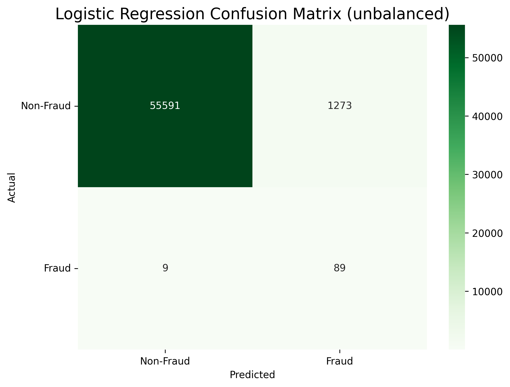
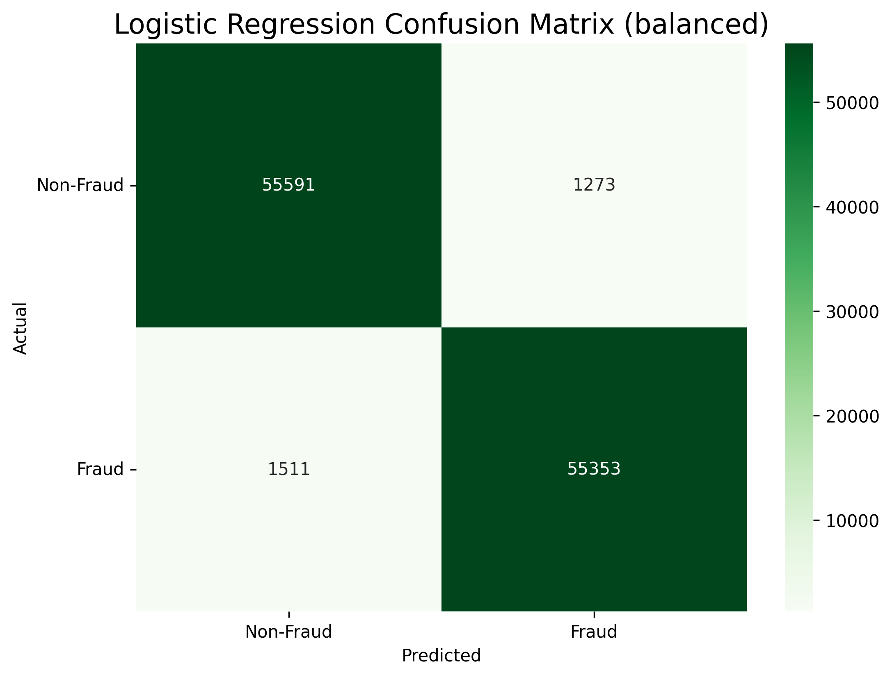
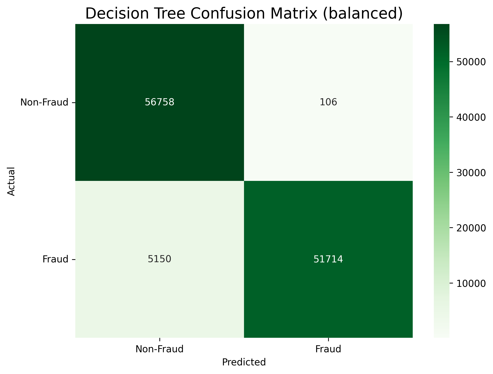
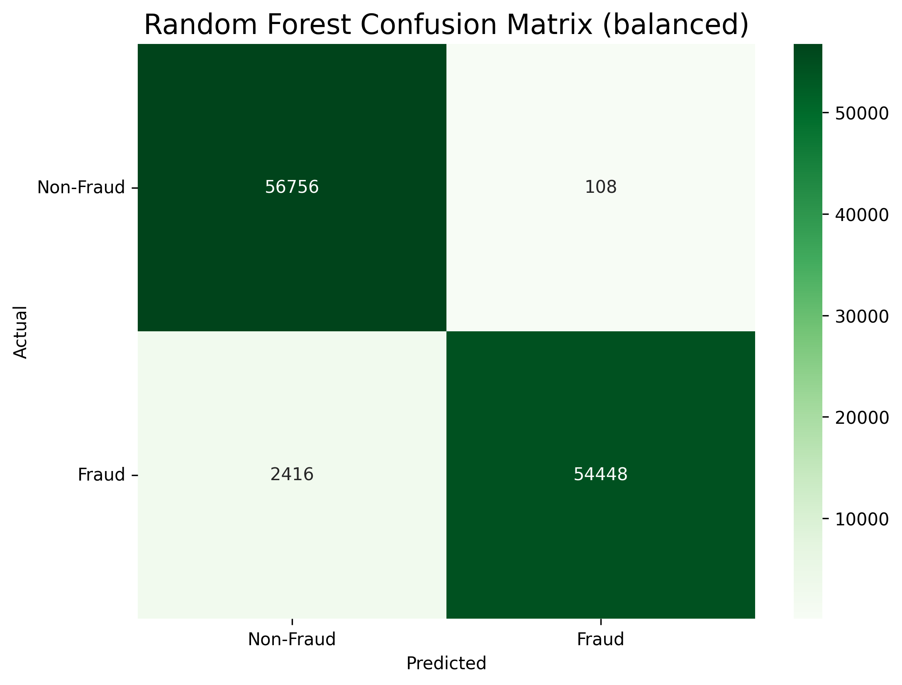
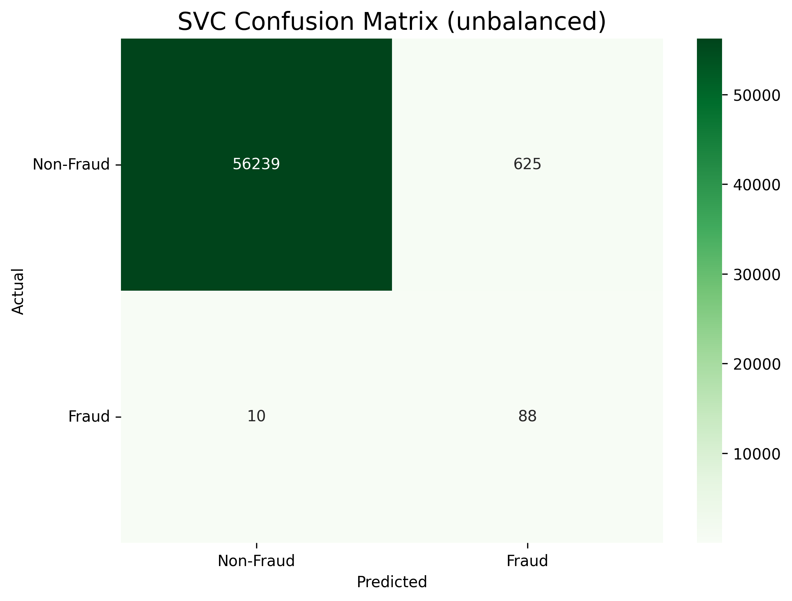
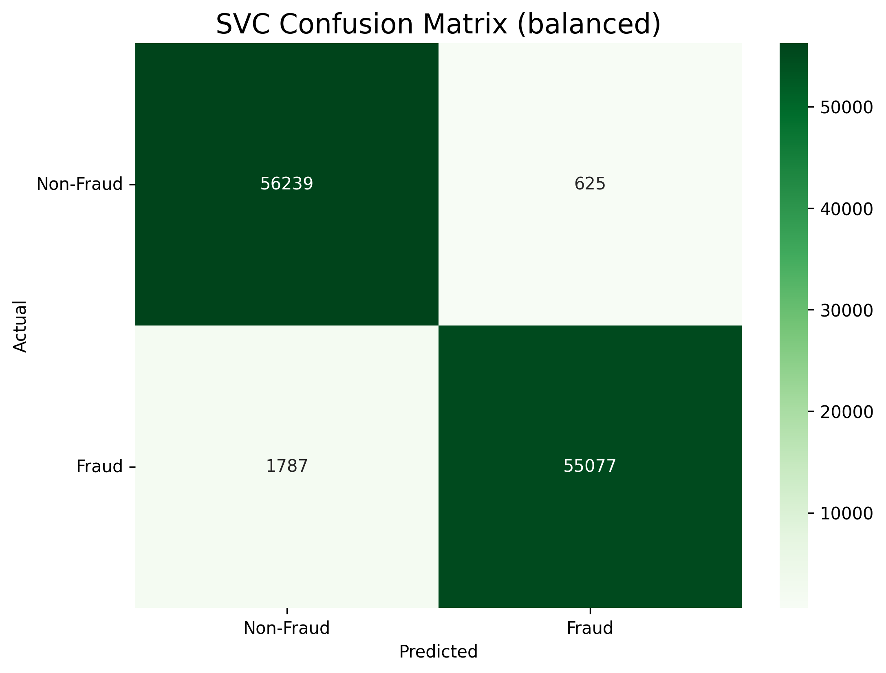
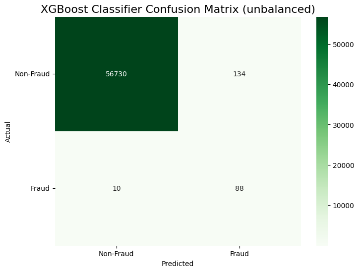
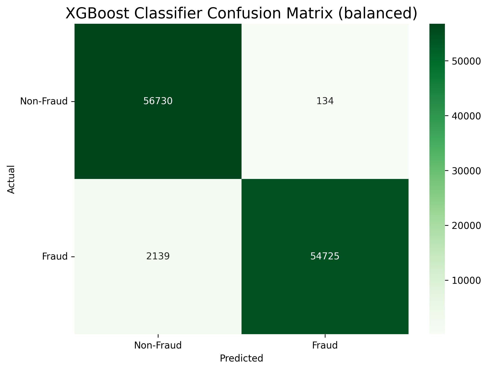

# Credit Card Fraud Detection using Machine Learning

**Author:** Mallikarjun Reddy Banelli  
**Supervisor:** Professor Michael Gilbert  
**University:** Clarkson University

---

## INTRODUCTION

Credit card fraud poses a significant threat in today’s digital economy. As online transactions surge, fraudsters employ sophisticated tactics to exploit payment system vulnerabilities. Timely detection and prevention are essential for financial security and customer trust.

This project leverages machine learning to detect fraudulent credit card transactions using a Kaggle dataset. The goal is to build accurate classifiers capable of identifying fraud in a highly imbalanced dataset, where fraudulent transactions constitute only 0.172% of records. Emphasis is placed on **Recall**, **F1 Score**, and **ROC-AUC** to evaluate model performance beyond accuracy.

---

## OBJECTIVE

To develop and evaluate multiple machine learning models that accurately detect fraudulent credit card transactions, minimizing false negatives and enhancing generalization through feature engineering, data balancing (SMOTE), and hyperparameter tuning.

---

## DATASET

- **Source:** [Kaggle - Credit Card Fraud Detection](https://www.kaggle.com/datasets/mlg-ulb/creditcardfraud)
- **Shape:** 284,807 rows × 31 columns

### 📊 Class Distribution

| Class | Description      | Count   |
|-------|------------------|---------|
| 0     | Non-Fraudulent   | 284,315 |
| 1     | Fraudulent       | 492     |

**Features:**

- `Time`, `Amount`  
- `V1` to `V28`: Anonymized principal components via PCA  
- `Class`: Target (0 = Non-Fraud, 1 = Fraud)

---

## PROCESS OVERVIEW

- **Exploratory Data Analysis (EDA):** Visualized class imbalance, feature correlations, and fraud indicators

 ### Correlation Heatmap

The heatmap below shows how features in the dataset are correlated with each other.  
This helps identify which variables might be most useful in detecting fraudulent transactions.

- **Data Preprocessing:** Applied `StandardScaler` and performed train-test split  
- **Balancing Strategy:** Used SMOTE to address class imbalance in the training set  
- **Modeling:** Trained five classification models  
- **Hyperparameter Tuning:** Used `HalvingRandomSearchCV` and `RandomizedSearchCV`  
- **Evaluation:** Confusion matrices, F1 Score, Recall, Precision, and ROC-AUC on both unbalanced and balanced test sets
- ### 🔍 Top 5 Features Most Correlated with Fraud

These features have the strongest relationship with fraudulent transactions based on correlation values.

### 🧪 After SMOTE – Balanced Class Distribution

| Class | Description    | Count   |
|-------|----------------|---------|
| 0     | Non-Fraudulent | 227,451 |
| 1     | Fraudulent     | 227,451 |

This plot shows the result of applying SMOTE to the training set, achieving a perfectly balanced class distribution.

## MODELS IMPLEMENTED

- Logistic Regression  
- Decision Tree Classifier  
- Random Forest Classifier  
- Support Vector Machine (LinearSVC with HalvingRandomSearchCV)  
- XGBoost Classifier

---

## EVALUATION METRICS

To ensure effective fraud detection, models were evaluated using:

- **Recall**: Critical for detecting fraud cases  
- **Precision**: To minimize false alarms  
- **F1 Score**: Balances Recall and Precision  
- **ROC-AUC**: Measures ability to distinguish between classes  
- **Confusion Matrix**: Visualizes false positives and false negatives

---

## RESULTS & COMPARISON

Models were evaluated on both the **original unbalanced test set** (20% of data) and a **SMOTE-balanced test set**.  
Random Forest and XGBoost achieved the highest performance, particularly in Recall and F1 Score.

| Model               | Accuracy | Recall  | Precision | F1 Score | ROC AUC |
|--------------------|----------|---------|-----------|----------|---------|
| SVC                | 99.46%   | 83.67%  | 22.10%    | 34.97%   | 91.58%  |
| Random Forest      | 99.82%   | 89.80%  | 48.62%    | 63.08%   | 94.82%  |
| Logistic Regression| 97.41%   | 91.84%  | 5.79%     | 10.89%   | 94.63%  |
| Decision Tree      | 99.76%   | 78.57%  | 39.49%    | 52.56%   | 89.18%  |
| XGBoost            | 99.66%   | 89.80%  | 32.23%    | 47.44%   | 94.74%  |

---
---

## 🔍 Confusion Matrices – Model Performance

Below are confusion matrices for each model evaluated on both the **unbalanced** and **SMOTE-balanced** test sets. These visualizations highlight the strengths and weaknesses of each classifier in detecting fraud.

---

### 🧪 Logistic Regression

**Unbalanced Test Set**  

**Balanced Test Set (SMOTE)**  

---

### 🧪 Decision Tree Classifier

**Unbalanced Test Set**  

**Balanced Test Set (SMOTE)**  

---

### 🧪 Random Forest Classifier

**Unbalanced Test Set**  

**Balanced Test Set (SMOTE)**  

---

### 🧪 Support Vector Machine (SVC)

**Unbalanced Test Set**  

**Balanced Test Set (SMOTE)**  

---

### 🧪 XGBoost Classifier

**Unbalanced Test Set**  

**Balanced Test Set (SMOTE)**  

---

##  Final Visual Summary

### ✅ Top Metrics Comparison Across Models

This chart compares model performance based on F1 Score, Recall, and ROC-AUC, highlighting the most effective classifiers for fraud detection.

---

### 🧾 Best Model Confusion Matrix (Random Forest – Unbalanced)

Random Forest performed best overall. Here is its confusion matrix from the unbalanced test set:

##  BEST MODEL

**Random Forest Classifier**

The Random Forest model achieved the best overall balance of performance across key metrics:
- **Highest Accuracy:** 99.82%
- **Strong Recall:** 89.80% (important for catching most fraud cases)
- **Best F1 Score:** 63.08% (harmonizes Precision and Recall)
- **Highest ROC-AUC:** 94.82%

While other models like XGBoost and Logistic Regression performed well on individual metrics, Random Forest delivered the most consistent and reliable results across all evaluation criteria, making it the most suitable model for this fraud detection task.

## Conclusion

This project demonstrates the effective use of machine learning techniques to tackle the challenge of credit card fraud detection using a highly imbalanced dataset. After extensive experimentation and model comparison, the **Random Forest Classifier** emerged as the best-performing model with:

- **Accuracy**: 99.82%  
- **Recall**: 89.80%  
- **F1 Score**: 63.08%  
- **ROC-AUC**: 94.82%

Key steps included applying **SMOTE** to balance the dataset, performing **feature scaling**, and using **cross-validation** and **hyperparameter tuning** to improve generalization. Exploratory Data Analysis (EDA) and a correlation heatmap provided insights into feature relationships and fraud patterns.

Among all the evaluated models, Random Forest provided the most consistent results across all key metrics, making it well-suited for deployment in real-world fraud detection systems where minimizing false negatives is crucial.

---
